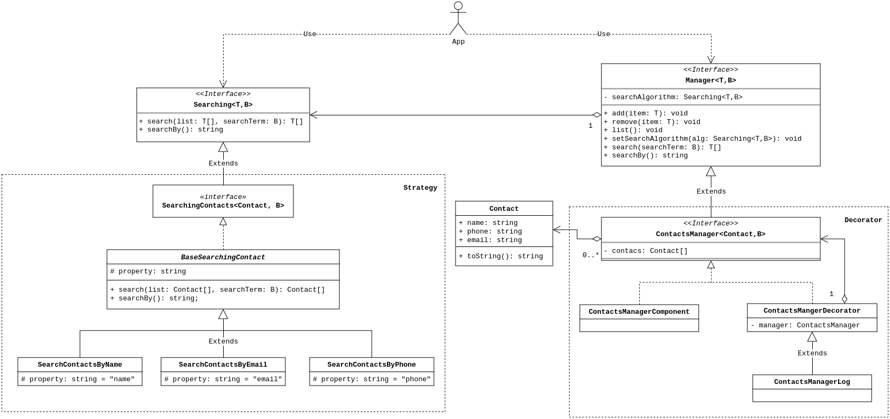

# Lista 1 - Implementação Design Patterns - AS64B - Arquitetura de Software - N14 (2024_01)

## Sumário

-   [Integrantes](#integrantes)
-   [Instruções](#instruções)
    -   [Objetivo](#objetivo)
    -   [Problema](#problema)
    -   [Requisitos Iniciais](#requisitos-iniciais)
-   [Descrição](#descrição)
-   [Padrões de Projeto Implementados](#padrões-de-projeto-implementados)
    -   [1. Decorator](#1-decorator)
    -   [2. Strategy](#2-strategy)
-   [Refatoração SOLID](#refatoração-solid)
-   [Execução](#execução)
    -   [Local](#local)
    -   [Docker](#docker)
-   [Arquitetura](#arquitetura)

## Integrantes

Vinicius de Carvalho Baggio

## Instruções

### Objetivo

Deve-se aplicar padrões de projeto em JavaScript, tanto estruturais quanto comportamentais em um contexto prático.

### Problema

Você foi contratado para desenvolver um sistema de gerenciamento de contatos em JavaScript. O sistema deve permitir aos usuários adicionar, remover e listar contatos. Além disso, eles devem ser capazes de buscar contatos por nome.

### Requisitos Iniciais

1. Implemente uma classe Contato que represente um contato com os seguintes atributos: nome, telefone e email.
1. Implemente uma classe GerenciadorContatos que possua métodos para adicionar, remover e listar contatos. Este gerenciador deve manter uma lista de contatos.
1. Implemente uma interface simples de linha de comando (CLI) que permita aos usuários interagirem com o sistema (adicionar, remover, listar e buscar contatos).
1. Utilize um padrão de projeto estrutural para garantir que a adição e remoção de contatos possam ser facilmente estendidas no futuro, sem modificar o código existente.
1. Utilize um padrão de projeto comportamental para implementar a funcionalidade de busca de contatos, garantindo que esta possa variar independentemente dos algoritmos de busca.

## Descrição

Este projeto consiste em um gerenciador de contatos que permite adicionar, remover, listar e buscar contatos. O gerenciador de contatos foi implementado utilizando os padrões de projeto Decorator e Strategy.

## Padrões de Projeto Implementados

### 1. Decorator

O padrão Decorator é um padrão estrutural que permite adicionar novos comportamentos a objetos individuais, sem afetar o comportamento de outros objetos da mesma classe. O padrão Decorator é uma alternativa flexível à herança para estender funcionalidades.
Mais informações sobre o padrão Decorator podem ser encontradas [aqui](https://refactoring.guru/design-patterns/decorator).

O padrão Decorator foi utilizado para adicionar funcionalidades de adição, remoção e listagem de contatos ao gerenciador de contatos.

### 2. Strategy

O padrão Strategy é um padrão comportamental que permite definir uma família de algoritmos, encapsular cada um deles e torná-los intercambiáveis. O padrão Strategy permite que o algoritmo varie independentemente dos clientes que o utilizam.
Mais informações sobre o padrão Strategy podem ser encontradas [aqui](https://refactoring.guru/design-patterns/strategy).

O padrão Strategy foi utilizado para implementar a funcionalidade de busca de contatos, permitindo que diferentes algoritmos de busca possam ser utilizados.

## Refatoração SOLID

Foi modificado a forma em como o aplicativo é executado, antes eram várias funções que recebiam um manager ESPECÍFICO e executava tarefas
em cima dele, agora criou-se uma classe App que guarda uma instância de Manager(interface), além de outros parâmetros necessários para
a execução do app, permitindo a utilização do aplicativo por qualquer manager concreto. (Inversão de Dependência.)
Além de refatorações que violavam o SRP, onde métodos executavam mais de uma função.

## Execução

### Local

```bash
$ npm install
$ npm run build
$ npm start
```

Se preferir, você pode executar o programa com dados genéricos para teste, estes dados estão em `src/data/data.json`.

```bash
$ npm run start:dummy
```

### Docker

```bash
$ docker compose run lista1
```

Se preferir, você pode executar o programa com dados genéricos para teste, estes dados estão em `src/data/data.json`.

```bash
$ docker compose run lista1 --dummy
```

## Arquitetura

<div align="center">
  
</div>
